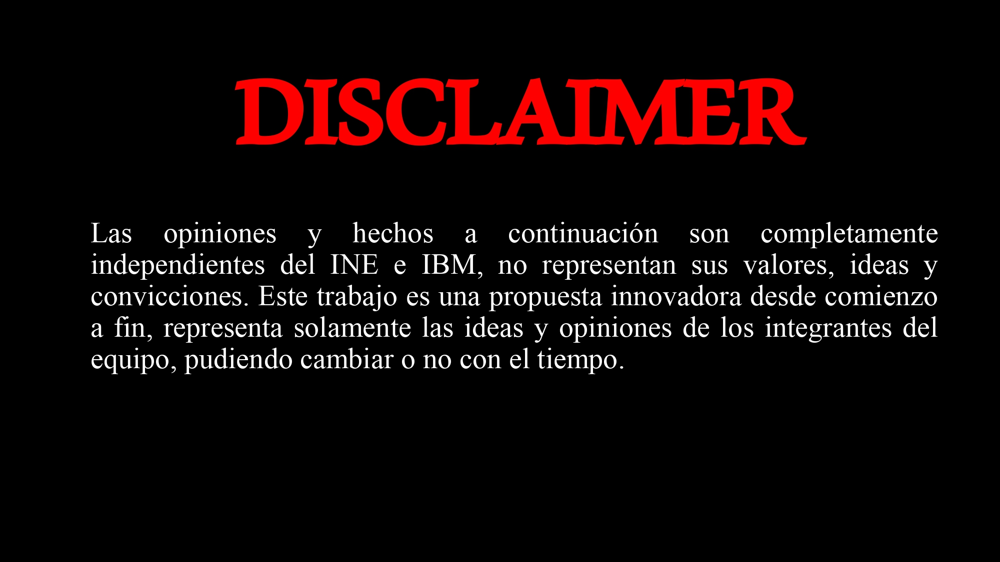

## Indice
1. [Equipo 2: Beyales](#equipo-2-Beyales)
2. [Reto](#reto)
3. [Solucion](#solucion)
4. [Tecnologias Usadas](#tecnologias-Usadas)
5. [Aplicacion Web (link)](#aplicacion-Web)
### Equipo 2: Beyales
***
Nuestro equipo esta conformado por:

<ul>
  <li>Yadhira Luna</li>
  <li>Leslie de Gante</li>
  <li>Oscar Miranda</li>
  <li>Jose Benito Romero</li>
</ul>

### Reto

Empresa: IBM

Dificultad: Media

Objetivo: Proponer un nuevo sistema de votación en el que se integre el ejercicio de TI.

Tecnologías: IBM Cloud

Descripción: El proceso electoral representa el principal mecanismo de participación ciudadana, razón por la cual le corresponde al Estado asumir la gran responsabilidad de proteger, auspiciar y fomentar el derecho del voto, considerando que es el medio en que los ciudadanos toman la decisión en elegir a las personas que los representaran, por lo que el voto se convierte en un derecho y en un deber. Se está buscando que por medio de la tecnología logremos diseñar un nuevo modelo de votación, y garantizar un proceso más seguro, eficiente, rápido, fácil de usar y accesible con la integración de dispositivos móviles en el proceso, sin dejar de lado la votación presencial, y por qué no, proponer algunos otros sistemas como el de Ranked voting como en otros países del mundo.
## Solucion
***
Aplicacion web desarollada para  

## Tecnologias Usadas
***
Estas son las tecnologias que usamos para desarrollar nuestra solucion:
* [Django](https://www.djangoproject.com/)
* [HTML5](https://developer.mozilla.org/es/docs/Web/Guide/HTML/HTML5)
* [JavaScript](https://developer.mozilla.org/es/docs/Web/JavaScript)
* [CSS3](https://developer.mozilla.org/es/docs/Web/CSS) 
* [Python](https://www.python.org/)
* Azure: se utilizo el servicio de App Service para hostear la aplicacion web en un servidor en la nube. 
## Aplicacion Web
***
Aplicacion web

https://elecciones.azurewebsites.net

## Informacion extra
***
La solución a este reto se realizo en base a los criterios establecidos en el marco legal y jurídico por parte del INE (organo encargado de realizar y coordinar los procesos electorales), a continuacion se enlistan los documentos que se utlizaron para la realizacion de la solucion al reto propuesto.

CÁMARA DE DIPUTADOS DEL H. CONGRESO DE LA UNIÓN. (2014, mayo). LEY GENERAL DE INSTITUCIONES Y PROCEDIMIENTOS ELECTORALES. Recuperado de https://www.ine.mx/wp-content/uploads/2020/07/Despen-LEGIPE-NormaINE.pdf

Dirección Ejecutiva de Capacitación Electoral y Educación Cívica. (2019). Criterios para la Elaboración de Materiales Didácticos y de Apoyo. Recuperado de https://repositoriodocumental.ine.mx/xmlui/bitstream/handle/123456789/112700/CGor201909-30-ap-9-a4.pdf

Instituto Nacional Electoral. (2017, diciembre). Reglamento de elecciones. Autor. Recuperado de https://www.ine.mx/wp-content/uploads/2018/03/Reglamento-de-Elecciones-01-03-18.pdf
